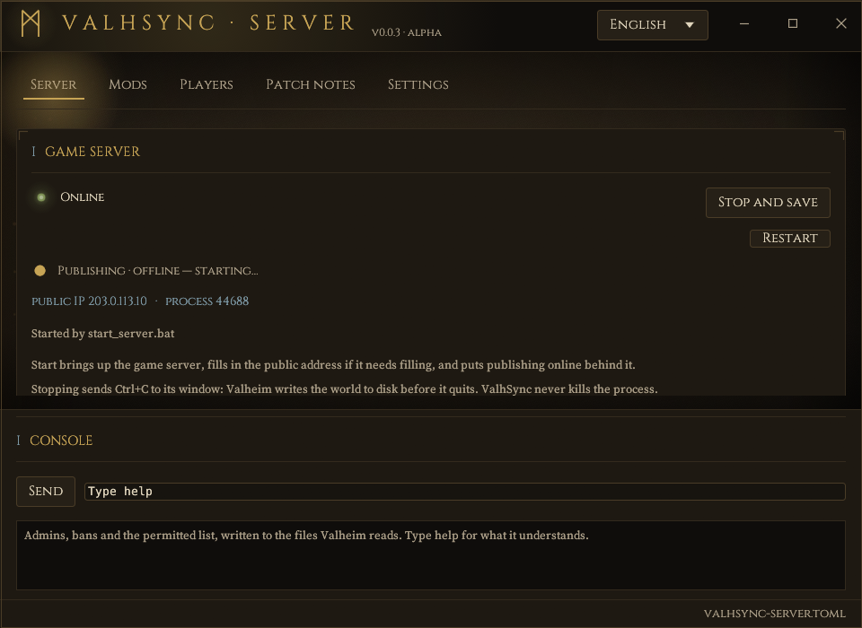
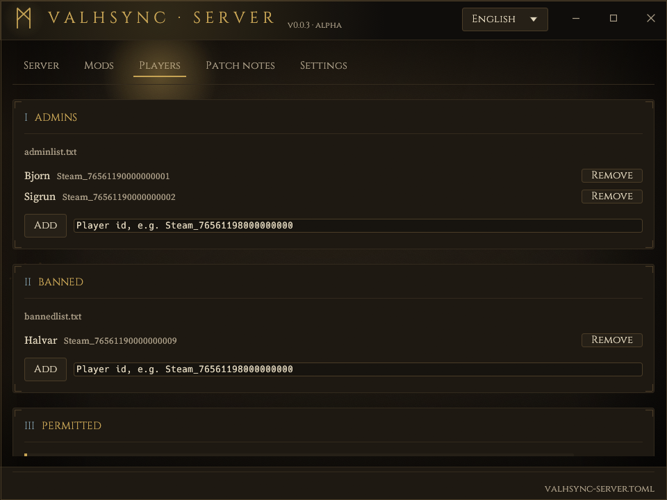
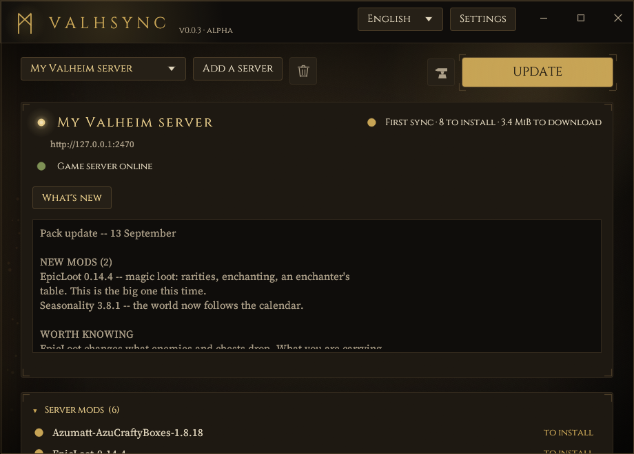

<h1 align="center">ValhSync</h1>

<p align="center">
  <strong>Run a modded Valheim server, and hand your players a launcher that keeps up with it.</strong>
</p>

<p align="center">
  <a href="https://github.com/Ztnzvoid/ValhSync/releases/latest"></a>
  <a href="https://ztnzvoid.github.io/ValhSync/"></a>
  
  
</p>

---

### The admin's window

Start and stop the dedicated server. Install a mod by dropping it on the
window. Turn one off, or take it out. Keep the admin and ban lists. Write the
patch note. Back up the world. The pack is published signed at the end of it.

<p align="center">
  
</p>

<p align="center">
  
</p>

### The player's launcher

One window, one button. Their BepInEx folder is brought in line with the
server's and the game starts. Nothing they put there themselves is ever
deleted, and what you wrote is a click away.

<p align="center">
  
</p>

---

> **Early version.** 0.0.5 is the fifth release and the third one published.
> One server has actually run it — Windows, a dedicated server beside it, a
> handful of players — and the whole chain works there. Linux builds and passes
> its tests, but no window has been opened on it. Back up the server's
> `BepInEx` folder before pointing ValhSync at one that matters, and open an
> issue when something breaks: that is what this stage is for.
>
> **Built with AI assistance.** All of it — the two programs, the tests, the
> documentation — was written with an AI assistant (Claude), directed and
> reviewed by a human. That is said here plainly because you should know what
> you are about to run.

## Getting started

**Admin.** Take `valhsync-<version>-<target>` from the [latest release](https://github.com/Ztnzvoid/ValhSync/releases/latest),
unpack it beside the dedicated server, run `valhsync-server`, and follow the
[server guide](https://ztnzvoid.github.io/ValhSync/server-guide.html). Keep the two executables in the same
folder: that is what feeds the launcher's update channel.

**Player.** Take `valhsync-launcher-<version>-<target>`, run `valhsync`, and
**paste the server's address — the same `ip:port` you type in Valheim**. That
is the usual way in: nothing to ask the admin for beyond the address they
already gave you. Press **PLAY**. The rest is the
[player guide](https://ztnzvoid.github.io/ValhSync/player-guide.html).

> An invite code (`valhsync1:…`) does the same thing and carries the server's
> key with it, so there is no fingerprint to compare. Either works; the
> address is simpler.

Both programs are also a CLI, which is the path on a headless Linux box:
`valhsync-server init | scan | serve | export | invite`, and
`valhsync join <ip:port> | status | sync | play`.

**[The full documentation](https://ztnzvoid.github.io/ValhSync/)** covers how it works, what is exposed, and
what has actually been tried.

## Security model, honestly

A BepInEx plugin is arbitrary .NET code running with the player's rights.
Joining a ValhSync server means trusting its admin, exactly like accepting their
zip of mods. ValhSync cannot protect against a malicious admin. It does protect
against everything else: tampering in transit (signature + digests), a swapped
server key (pinned key, explicit re-import required), path tricks in a manifest
(`../`, drive letters, UNC, reserved names, symlinks: the whole manifest is
rejected), oversized packs (size and count limits), and its own bugs (journaled
backups, rollback). The whole of it is in
[SECURITY.md](SECURITY.md).

## Languages

Both windows speak English, Français, Deutsch, Español, Italiano, Polski,
Português and Русский, chosen from a menu in the header and remembered.
English is the default and the fallback for anything else; the language the
system asks for is offered first.

Every string in both windows goes through one table per window, so a missing
translation is a build error rather than a sentence in the wrong language:
[`crates/valhsync/src/gui/i18n.rs`](crates/valhsync/src/gui/i18n.rs) and
[`crates/valhsync-server/src/gui/i18n.rs`](crates/valhsync-server/src/gui/i18n.rs).

Translations other than English and French were written to be idiomatic rather
than literal and have not been reviewed by native speakers — corrections are
very welcome, and each is one row. The places most likely to read oddly are
the strings that follow a numeral, where Polish and Russian inflect and the
table currently carries one form.

The documentation is English only. The software is not.

## What has been tested

Narrower than the code's reach, and worth saying so.

| | |
|---|---|
| **Windows, x86_64** | Verified end to end: a PC running the Valheim dedicated server with the publisher beside it, and several players who synced from it on their own machines and joined. |
| **Linux, x86_64** | Builds and passes the suite in CI — as of this repository's first run, and not before it. The claim that it had been doing so all along was false: there was no CI until the project was published, and the first run found two things that had never compiled on Linux at all. No window has ever been opened on Linux either, and no game started. |
| Proton, Steam Deck, macOS | Untested. |
| A dedicated server in Docker | Untested, and partly out of reach by design: the publisher finds the game server among processes, so it cannot see one in another container. Publishing from a mounted volume should work; starting, stopping and the console will not. |
| Hosted servers | The layout has a test; no real provider has been on the other end. |

If you try one of these, an issue saying what happened is worth more than any
amount of reasoning from here.

## Building

Rust 1.88+ (`rust-toolchain.toml` pins 1.95 for development).

```bash
cargo build --release          # target/release/valhsync(.exe), valhsync-server(.exe)
cargo test --workspace
cargo clippy --workspace --all-targets -- -D warnings
```

Linux needs the usual winit/egui build packages (`libxkbcommon-dev
libwayland-dev libxcb-render0-dev libxcb-shape0-dev libxcb-xfixes0-dev
libgl1-mesa-dev`).

Workspace layout: `crates/valhsync-core` (pure logic, no network, where the
tests live), `crates/valhsync-server`, `crates/valhsync` (CLI + window in one
executable). Dependencies are permissively licensed; `cargo deny` enforces the allow-list
in `deny.toml` — MIT, Apache-2.0, BSD, ISC, Unicode and MPL-2.0, the last of
which covers one file-scoped-copyleft crate reached through `directories`. No
GPL, AGPL or unlicensed code.

### Release archives

```powershell
pwsh scripts/package.ps1        # dist/*.zip and dist/*.zip.sha256
```

Two archives, because two different people receive them:

| Archive | For | Holds |
| --- | --- | --- |
| `valhsync-<version>-<target>` | the admin | both programs, both guides, the threat model |
| `valhsync-launcher-<version>-<target>` | players | the launcher, the player guide, the licences |

An admin forwards the second one and nothing else. Both are built from a
scratch folder holding only what the script copies in, so no configuration, no
signing key and no server address ever travels with them — and the build
remaps its source paths, so the binaries do not carry the name of whoever
built them. Tagging `v*` makes CI produce the same four files, plus the Linux
tarballs and a combined `SHA256SUMS`.

The Windows binaries are not signed yet, which is why SmartScreen warns on a
first run — check a download against `SHA256SUMS` until that changes. A
certificate has been applied for and the release workflow already submits the
binaries for signature; the [code signing policy](docs/code-signing-policy.md)
says who can cause one to happen, and what it would and would not mean.

The 0.0.4 build was put through VirusTotal:
[**0 detections out of 70** for `valhsync.exe`](https://www.virustotal.com/gui/file/0673c62743e4c568595c6f3bd2bd6cc7bafc4dff31686790d5ef570294d0a8c5), and
[0 out of 67 for the package it travels in](https://www.virustotal.com/gui/file/1b070938dc30dd3574277bf28ecb2e57897cdfb1088fb7ad5df5e889be6e6f6d). Any file can be checked the
same way without downloading it twice — paste its SHA-256 into VirusTotal's
search box.

## Redistributing mods

Serving DLLs from your own server is common between friends, but some mod
authors forbid redistribution. Check the licenses of what you publish.

## License

MIT OR Apache-2.0, at your option. Written from scratch; not a fork of any
existing mod manager.

The windows embed the **Cinzel** typeface by Natanael Gama, under the SIL Open
Font License 1.1. Its licence travels with the source in
`crates/valhsync-ui/assets/OFL-Cinzel.txt` and with every release package.
The body text is **Source Serif 4** by Frank Grießhammer, under the same
licence (`crates/valhsync-ui/assets/OFL-SourceSerif.txt`).
